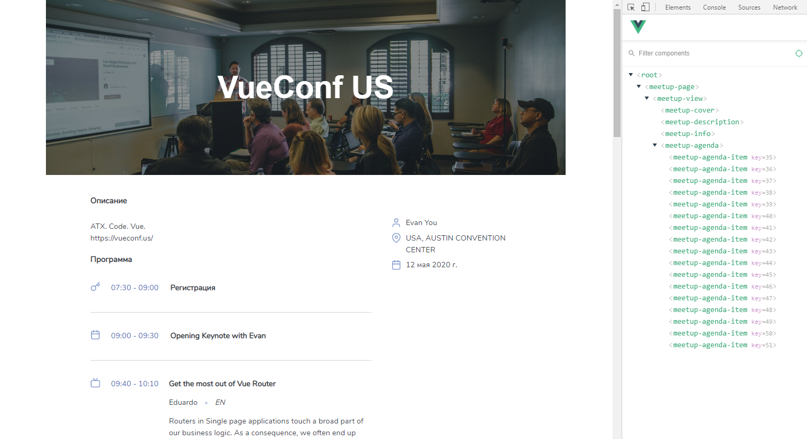

# MeetupPage

Требуется разделить Vue приложение вывода описания митапа на компоненты:
- **MeetupPage**
    - Компонент, получающий данные митапа с `API` и выводящий информацию о нём с помощью компонента `MeetupView`;
- **MeetupView**
    - Компонент с полной информацией о митапе;
    - Обязательный пропс объект `meetup` с данными митапа;
- **MeetupCover**
    - Компонент с изображением и названием митапа;
    - Необязательные строковые пропсы `link` и `title` ссылкой на изображение и заголовком;
- **MeetupDescription**
    - Компонент с описанием митапа;
    - Необязательный строковый пропс `description` с описанием;
- **MeetupInfo**
    - Компонент с краткой информацию о митапе списком: организатора, место и датой;
    - Обязательный пропс объект `meetup` с данными митапа;
- **MeetupAgenda**
    - Компонент с программой митапа;
    - Обязательный пропс массив объектов `agenda` с программой митапа;
- **MeetupAgendaItem**
    - Компонент с пунктом программы митапа;
    - Обязательный пропс объект `agendaItem` с данными пункта программы митапа;

Модуль `data.js` содержит некоторые полезные функции и константы.

Обратите внимание, что во всех компонентах, где в качестве пропса приходит митап или программа, ожидается, что компонент отработает корректно, если данные к нему придут в "сыром виде", в котором они приходят с API. 

###### Результат

--- 

**- Для решения отредактируйте файлы `Meetup**.js`**
