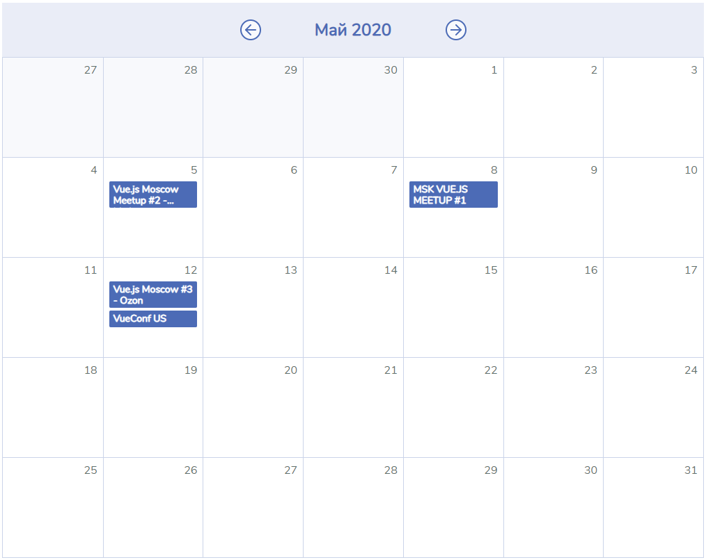

# MeetupsCalendar

Требуется разработать компонент `MeetupsCalendar` для вывода списка митапов в виде календаря.

- Компонент принимает на вход список митапов
- Изначально в компоненте отображается текущий месяц и год
- Вверху календаря отображается через пробел название текущего месяца (локализовано) и год
- Кнопки на календаре переключают на отображение предыдущего и следующего месяцев
- Если в целое число недель попадают дни предыдущего или следующего месяцев, ячейки этих дней требуется отобразить неактивными
- В каждой ячейке выводится список митапов этого дня

Предлагается не использовать сторонние библиотеки для работы с датой.

###### Результат

--- 

**- Для решения отредактируйте файл `MeetupsCalendar.js`**
